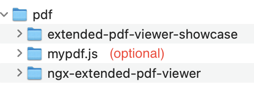

# Preparations

You need a current node.js and roughly 20-30 minutes of time, maybe even less. Most of the build process is automated. This recipe shows the Unix and MacOS scripts, but there are also Windows batch files you can use. Sometimes the two sets of files diverge (because I'm lazy - feel free to blame me!). If you run into trouble, have a look at the Unix files. I use them much more often, so they are the "source of truth".

## Use the showcase to test your changes of ngx-extended-pdf-viewer

In a nutshell: you need two projects, ngx-extended-pdf-viewer and extended-pdf-viewer, in the same parent folder. Both projects are standard Angular projects, so I hope you don't run into nasty surprises.

1. Create a new folder "pdf".
2. `cd pdf`
3. `git clone https://github.com/stephanrauh/ngx-extended-pdf-viewer`
4. `cd ngx-extended-pdf-viewer`
5. `npm install`
6. `cd ..`
7. `git clone https://github.com/stephanrauh/extended-pdf-viewer-showcase`
8. `cd extended-pdf-viewer-showcase`
9. Make sure npm can install packages from GitHub. I hope I can get rid of this requirement soon! In the meantime, follow the instructions at https://docs.github.com/en/packages/working-with-a-github-packages-registry/working-with-the-npm-registry#authenticating-to-github-packages. Stop at the "publishing a package" section. All you need is a GitHub token allowing you to read an npm package from GitHub and to log in to npm using this GitHub token.
10. `npm install`
11. `cd ../ngx-extended-pdf-viewer && npm run showcase && cd ../extended-pdf-viewer-showcase && ng serve -o`

If you modify the the library, you need to stop the Angular server and run step 11. That's a bit annoying: until Angular 10 (or so) Angular used to recompile and redeploy after running `npm run showcase` in a secondary terminal window. For some reason unknown, this useful feature is broken with contemporary versions of Angular.

## Build ngx-extended-pdf-viewer with a custom version of pdf.js

### What is pdf.js?

ngx-extended-pdf-viewer is just a shallow wrapper arounds Mozilla's PDF viewer. This viewer, in turn, is an open-source project called pdf.js. However, I had to fork that library. Over time, I've implemented quite a few changes and improvements to pdf.js. When I'm talking about pdf.js, I usually refer to my fork, which is frequently updated with the latest changes implemented by the Mozilla team.

### How to build it all from scratch

In a nutshell: you need three projects:

- my clone of pdf.js,
- ngx-extended-pdf-viewer,
- and extended-pdf-viewer-showcase

Put all of them in the same parent folder. pdf.js needs to be built first, followed by ngx-extended-pdf-viewer and extended-pdf-viewer-showcase.

1. `mkdir pdf`
1. `cd pdf`
1. `git clone git@github.com:stephanrauh/extended-pdf-viewer-showcase.git`
1. `cd extended-pdf-viewer-showcase`
1. `npm install`
1. `cd ..`
1. `git clone https://github.com/stephanrauh/pdf.js.git`
1. `mv pdf.js mypdf.js` (or `rename pdf.js mypdf.js` if you're using Windows)
1. `cd mypdf.js`
1. `npm install -g gulp-cli`
1. `npm install`
1. `gulp generic` (not necessary - but it gives you faster feedback if there's a compile error)
1. `cd ../ngx-extended-pdf-viewer`
1. `sh ./updateMozillasPdfViewer.sh`
1. `npm run showcase`
1. `cd ../extended-pdf-viewer-showcase`
1. `ng s -o`

## Living on the bleeding edge

I maintain two different versions of pdf.js. There's the branch I call stable, and there's the "bleeding edge" branch. The stable branch has a numeric name. At the time of writing, that's 2.14. The stable branch is based on the latest release of pdf.js.

The branch I call "bleeding edge" is based on the latest developer commits of pdf.js. Generally speaking, pdf.js has an extraordinary high quality, so it's unlikely you run into trouble using this version. There's a "but": when the Mozilla team modifies some source code I've also modified, I always have a hard time merging the two branches and adding the improvements from both sides. So I can't guarantee the "bleeding edge" branch to work. It does, 99% of the time, but don't take my word for it. Nonetheless, I'd like to encourage you to use it in development (but never in production!) because this way you can help me spot errors early.

Compiling the "bleeding edge" branch of pdf.js is easy:

1. `cd mypdf.js`
1. `git checkout bleeding-edge`
1. `cd ../ngx-extended-pdf-viewer``
1. `./updateMozillasPdfViewer.sh && npm run showcase`

## Dockerized smoke tests

The folder `compatibility-tests` contains tiny test suites. They are meant to be run after publishing a new version. They build an new greenfield projects in Docker and check if the PDF file renders correctly.

Currently, these test must be run manually. CD to one of the `AngularXX` folders and run the script `test.sh`.
